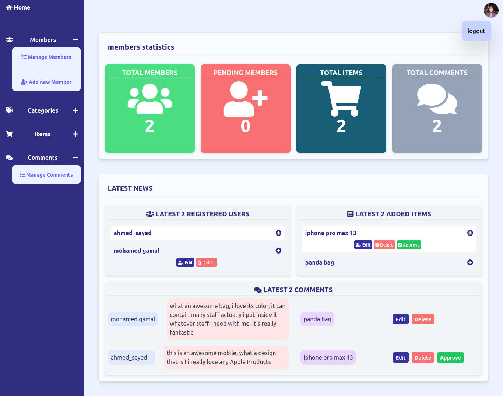

# Full Ecommerce With Laravel

Full demo Ecommerce developed with laravel framework

## sample images of the App Screens
Admin Login Screen

Admin Dashboard Screen

Admin Manage Members Screen

Admin Add New Member Screen

Admin Manage Categories Screen

Admin Add New Category Screen

Admin Manage Items Screen

Admin Add New Item Screen

Admin Manage Comment Screen

## Admin Features
- Admin can Login and Logout
- Admin Has a Fully Functioned Dashboard
- Admin Can Manage Members
  - Edit | Delete | Add
  - Approve Pending Members
- Admin Can Manage Categories
  - Edit | Delete | Add
  - Change The Category Visibility
  - Allow/Disallow Ads For a Category
  - Allow/Disallow Comments On A Category
- Admin Can Manage Items
  - Edit | Delete | ADD
  - Show Comments Of an Item
- Admin Can Manage Comments
  - Edit | Delete
  - Approve Comments

